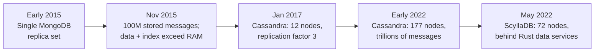
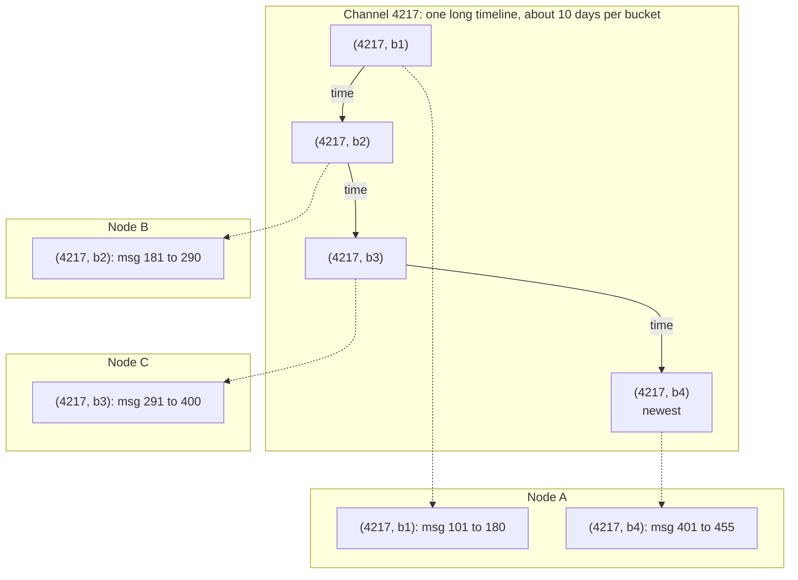
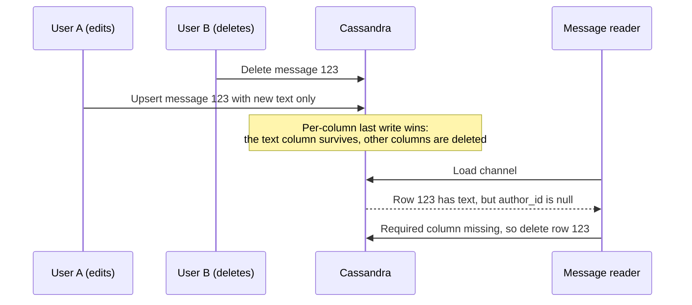
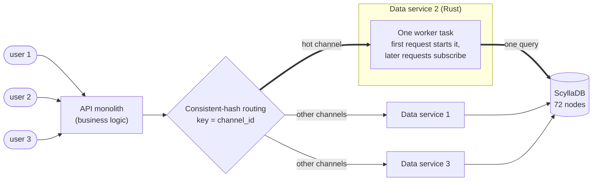

Discord decided early on to keep every chat message forever, so users can scroll back through their history on any device. That one product decision has driven two database migrations. First, after hitting MongoDB's limits in late 2015, the messages moved from a single MongoDB replica set to Cassandra. By early 2022 Cassandra had grown to 177 nodes, and the messages moved again, this time to ScyllaDB, with a new Rust "data services" layer in front of it.

Discord engineers wrote up both migrations: Stanislav Vishnevskiy's [How Discord Stores Billions of Messages](https://discord.com/blog/how-discord-stores-billions-of-messages) (January 13, 2017) and Bo Ingram's [How Discord Stores Trillions of Messages](https://discord.com/blog/how-discord-stores-trillions-of-messages) (March 6, 2023). I'll call them **[2017]** and **[2023]** below. Every number and specific claim in this post comes from those two articles unless I link something else. Paragraphs marked **My take** are my own analysis, not Discord's.



*Figure 1: Milestones in Discord's message storage, as reported in [2017] and [2023].*

## The problem: random reads and wildly uneven channels

The first version of Discord was built in just under two months in early 2015. Everything lived in a single MongoDB replica set, and messages had a single compound index on `channel_id` and `created_at`. This was a deliberate choice: build quickly, but keep a path to something more robust. Around November 2015 the database hit 100 million stored messages. The data and the index no longer fit in RAM, and latencies became unpredictable [[2017]](https://discord.com/blog/how-discord-stores-billions-of-messages).

Before choosing a replacement, the team studied how messages were actually read. Reads were "extremely random," the read/write ratio was about 50/50, and different kinds of servers behaved very differently [[2017]](https://discord.com/blog/how-discord-stores-billions-of-messages):

- **Voice-heavy servers** send almost no messages and are unlikely to reach 1,000 in a year. But returning just 50 of them can cause many random disk seeks and disk cache evictions.
- **Private, text-heavy servers** send roughly 100,000 to 1 million messages a year and mostly read recent ones. They usually have fewer than 100 members, so their data is requested rarely and is unlikely to be in the disk cache.
- **Large public servers** have thousands of members sending thousands of messages a day. They mostly read the last hour, and they read it often, so their data is usually cached.

Planned features (jumping to mentions from the last 30 days, jumping to pinned messages, full-text search) would add even more random reads.

The requirements that followed were: linear scalability without manual re-sharding, automatic failover, low maintenance, proven technology, predictable performance, not a blob store, and open source. "Predictable performance" was specific: alerts fire when the API's 95th-percentile response time goes above 80 ms, and the team did not want to cache messages in Redis or Memcached. Cassandra was the only database that met every requirement [[2017]](https://discord.com/blog/how-discord-stores-billions-of-messages).

## The data model: bounded partitions

[2017] describes Cassandra as a **KKV store**. The first K, the *partition key*, decides which nodes hold the data and where it sits on disk. The second K, the *clustering key*, identifies a row inside the partition and also sets the sort order. You can think of a partition as an ordered dictionary.

Every message query is scoped to a channel, so `channel_id` became the partition key. `created_at` was a poor clustering key because two messages can share a timestamp. Every Discord ID is a Snowflake, which sorts chronologically, so the clustering key became `message_id`. That let Discord tell Cassandra exactly where to start a range scan [[2017]](https://discord.com/blog/how-discord-stores-billions-of-messages).

The import then produced log warnings about partitions over 100 MB. Cassandra advertises support for 2 GB partitions, but large partitions put heavy GC pressure on the database during compaction and cluster expansion. A single partition also can't be spread across the cluster. A channel can live for years and keep growing, so partition size had to be bounded. Discord split messages into **time buckets**. Based on its largest channels, about 10 days of messages per bucket kept partitions comfortably under 100 MB. Buckets had to be derivable from a `message_id` or a timestamp [[2017]](https://discord.com/blog/how-discord-stores-billions-of-messages):

```sql
PRIMARY KEY ((channel_id, bucket), message_id)
--           ^ partition key       ^ clustering key (Snowflake, time-sortable)
```

Snowflakes make the bucket cheap to compute. According to Discord's [API reference](https://discord.com/developers/docs/reference#snowflakes), the top 42 bits of a 64-bit Snowflake are milliseconds since the "Discord Epoch" (the first second of 2015), and `snowflake >> 22` recovers that timestamp. **My take:** that means a bucket can be computed from the ID alone, with something like `(message_id >> 22) / bucket_width_ms`. That expression is my illustration. [2017] doesn't give the formula.



*Figure 2: The partition key `(channel_id, bucket)` gives each roughly 10-day slice of a channel its own partition, so a channel's history is spread across the cluster. Within a partition, rows are sorted by `message_id`, so "latest 50 messages" is a single range scan. The channel and message numbers are made up, and replication (three copies of each partition in 2017) is left out to keep it readable.*

### The read path

To load recent messages, Discord builds a range of buckets running from the current time back to the channel's creation. The `channel_id` is also a Snowflake and must be older than the channel's first message. It then queries those partitions one after another, newest first, until it has enough messages. Rarely active channels may have to walk several buckets, but active channels usually fill the page from the first partition, and active channels are the majority. In testing, writes were sub-millisecond and reads came in under 5 ms. Performance stayed consistent through a week of testing [[2017]](https://discord.com/blog/how-discord-stores-billions-of-messages).

## What broke after the move to Cassandra

### Upserts and the edit/delete race

Discord dark-launched Cassandra by reading and writing to both MongoDB and Cassandra. Almost immediately, the bug tracker filled with errors saying `author_id` was null, even though it's a required field [[2017]](https://discord.com/blog/how-discord-stores-billions-of-messages).

Cassandra is an AP database. Reading before writing is an anti-pattern, so every write is effectively an upsert, and conflicts are resolved with last-write-wins *per column*. When one user edited a message at the same moment another user deleted it, the result was a row containing only the primary key and the edited text.



*Figure 3: The edit/delete race described in [2017], and the fix Discord chose. The sequence is my illustration of the scenario the article describes.*

Discord considered two fixes. Writing the whole message back on every edit could resurrect deleted messages and create more conflicts with concurrent writes to other columns. Instead, they chose to detect corruption on read: pick a required column (`author_id`), and if it's null, delete the message [[2017]](https://discord.com/blog/how-discord-stores-billions-of-messages).

### Tombstones: deletes are writes

Because Cassandra is eventually consistent, it can't delete data immediately. It writes a **tombstone**, which replicates like any other write and is skipped at read time. Tombstones last for a configurable period (10 days by default) and are removed during compaction once that period expires. Writing a null is exactly the same as deleting a column, so it also creates a tombstone. Discord's message schema had 16 columns, but the average message set only 4. That meant most inserts wrote 12 tombstones for no reason. The fix was simple: only write non-null values [[2017]](https://discord.com/blog/how-discord-stores-billions-of-messages).

### The big surprise: one message, millions of tombstones

After the dark launch, Discord made Cassandra the primary database and phased out MongoDB within a week. It worked for about six months. Then Cassandra became unresponsive, with constant 10-second stop-the-world GC pauses. The cause was a single channel that took 20 seconds to load. It was in the public Puzzles & Dragons Subreddit server, and it contained exactly one message: millions of others had been deleted through the API. Every load made Cassandra scan millions of tombstones, generating garbage faster than the JVM could collect it [[2017]](https://discord.com/blog/how-discord-stores-billions-of-messages).

There were two fixes:

1. Tombstone lifetime was cut from 10 days to 2. That was safe because Discord ran Cassandra repairs (an anti-entropy process) every night on the message cluster.
2. The query code began tracking empty buckets per channel and skipping them, so in the worst case only the most recent bucket would be scanned again.

At the time of the 2017 post, Discord ran a 12-node cluster with a replication factor of 3. That article already listed exploring Scylla, a Cassandra-compatible database written in C++, as a long-term idea [[2017]](https://discord.com/blog/how-discord-stores-billions-of-messages).

## Hot partitions and operational toil (2022)

By early 2022 the `cassandra-messages` cluster had grown to 177 nodes holding trillions of messages. On-call was paged often, latency was unpredictable, and maintenance operations had become too expensive to run [[2023]](https://discord.com/blog/how-discord-stores-trillions-of-messages).

The main culprit was **hot partitions**. In Cassandra, reads cost more than writes. A write goes to a commit log and an in-memory memtable, but a read may have to check the memtable *and* several on-disk SSTables. When many users read the same channel-and-bucket partition at once, the replicas holding it fall behind. Discord reads and writes at **quorum** consistency, so every query touching those nodes slowed down, and one busy channel could raise latency across the cluster [[2023]](https://discord.com/blog/how-discord-stores-trillions-of-messages).

Maintenance made things worse. Compactions fell behind, which made reads even more expensive. The team regularly did a "gossip dance": take a node out of rotation so it could compact without serving traffic, bring it back to pick up hints from hinted handoff, and repeat until the backlog cleared. They also spent a lot of time tuning JVM garbage collection and heap settings, because GC pauses caused serious latency spikes [[2023]](https://discord.com/blog/how-discord-stores-trillions-of-messages).

ScyllaDB appealed because it promised better performance, faster repairs, stronger workload isolation through a shard-per-core architecture, and no garbage collector. By 2020 Discord had moved every database except `cassandra-messages` to ScyllaDB. Before moving messages, the ScyllaDB team improved reverse-query performance (scanning in the opposite order of the table's sort, such as reading messages oldest-first), which removed the last blocker [[2023]](https://discord.com/blog/how-discord-stores-trillions-of-messages).

## The fix, part 1: data services that coalesce requests

Discord suspected a new database alone wouldn't fix hot partitions, because ScyllaDB can have them too. So the team built **data services**: intermediary services between the API monolith and the database clusters, written in Rust (the article credits the Tokio async ecosystem as a strong foundation). They expose roughly one gRPC endpoint per database query and intentionally contain no business logic [[2023]](https://discord.com/blog/how-discord-stores-trillions-of-messages). They work in two parts:

1. **Request coalescing.** If several users request the same row at the same time, the database is queried once. The first request starts a worker task. Later requests see that the task exists and subscribe to it. The worker queries the database and returns the row to every subscriber.
2. **Consistent-hash routing.** Every request carries a routing key. For messages, the key is the channel ID, so every request for a channel reaches the same data-service instance. That's what lets duplicate requests actually meet and be merged.

[2023] uses an `@everyone` announcement in a large server as its example: lots of users open the app at the same moment to read the same message. Before data services, that kind of spike could create a hot partition and page on-call.



*Figure 4: The read path after 2022. Hashing on `channel_id` sends every request for a hot channel to one data-service instance, where identical in-flight reads share one worker task and one database query. The component names and node count come from [2023]; the layout is mine.*

Data services went in *before* the migration and helped a lot, but they didn't fix everything. Cassandra still had hot partitions and latency spikes, just less often. That bought time to prepare the ScyllaDB cluster [[2023]](https://discord.com/blog/how-discord-stores-trillions-of-messages).

**My take:** without this layer, N concurrent reads of one hot partition become N quorum reads against the same replicas. With it, they collapse to roughly one read per row at a time. The idea is the same as Go's [`singleflight`](https://pkg.go.dev/golang.org/x/sync/singleflight) package, extended across a fleet: coalescing only helps if duplicate requests land in the same process, which is why the routing matters as much as the deduplication.

## The fix, part 2: migrating trillions of messages

The requirements were trillions of messages, no downtime, and speed, because the team was still firefighting Cassandra. The new ScyllaDB cluster used a "super-disk" storage topology: local SSDs for speed, mirrored with RAID to a persistent disk for durability [[2023]](https://discord.com/blog/how-discord-stores-trillions-of-messages).

The first plan was phased. New data would go to ScyllaDB after a cutover time, and historical data would be backfilled behind it. Discord started dual-writing new data to both clusters and set up ScyllaDB's Spark migrator. After a lot of tuning, it estimated **three months** to finish.

Instead, the team extended its own data-service library into a migrator, which took an afternoon. It reads token ranges from the database, checkpoints progress locally in SQLite, and streams rows into ScyllaDB. The new estimate was **nine days**. That was fast enough to drop the time-based phased plan and switch everything over at once [[2023]](https://discord.com/blog/how-discord-stores-trillions-of-messages).

The migrator ran at up to **3.2 million messages per second** and then stalled at **99.9999%** complete. The last few token ranges held huge runs of tombstones that Cassandra had never compacted, and reading them timed out. Once those ranges were compacted, the migration finished seconds later. To validate it, Discord sent a small percentage of reads to both databases and compared the results. ScyllaDB became the primary messages database in **May 2022** [[2023]](https://discord.com/blog/how-discord-stores-trillions-of-messages).

## Results

According to [2023](https://discord.com/blog/how-discord-stores-trillions-of-messages):

| Metric | Cassandra | ScyllaDB |
| --- | --- | --- |
| Nodes | 177 | 72 |
| Disk per node | 4 TB (average) | 9 TB |
| Historical message fetch, p99 | 40–125 ms | 15 ms |
| Message insert, p99 | 5–70 ms | 5 ms (steady) |

During the 2022 World Cup final, goals and other match events showed up as spikes in Discord's message-send graphs, and the system handled them without trouble [[2023]](https://discord.com/blog/how-discord-stores-trillions-of-messages).

## Key tradeoffs

| Decision | What Discord gained | What it cost |
| --- | --- | --- |
| AP database with per-column last-write-wins | Availability and automatic failover; writes can go to any node | Odd half-merged rows under concurrent writes (the edit/delete race) |
| Time-bucketed partitions | Bounded partition size; a channel's history spreads across the cluster | Quiet channels need several sequential queries |
| No Redis or Memcached tier (a stated requirement) | Fewer moving parts; performance has to come from the data model | Every read reaches the database |
| Coalescing in a dedicated data service | Hot-key load is cut *before* the database; no business logic to tangle with | An extra network hop and another service to run |
| Custom Rust migrator instead of the Spark migrator | Estimate fell from three months to nine days, so a single cutover replaced a phased one | A custom tool to build and own |

**My take:** the decisions and gains come from the two articles. Parts of the "What it cost" column are my reading, because the articles don't always spell out costs.

## Patterns you can reuse

This section is my own synthesis of the two articles.

- **Bound your partitions.** A key that grows forever (a user, a channel, a device) will eventually be your biggest problem. Add a derived component, usually a time bucket, and size it from your *largest* real tenant, not the average one. Discord sized buckets from its largest channels.
- **Make IDs carry order.** Time-sortable IDs give you a clustering key with no ties, cheap range scans, and buckets you can compute from the ID alone.
- **Learn your store's delete semantics.** In Cassandra-style systems, deletes and nulls are writes, and an "empty" range can be the most expensive thing to read. Plan delete-heavy workloads around tombstone lifetime, repair cadence, and skipping ranges you know are empty.
- **Under last-write-wins, rows can end up half-merged.** Pick a required "sentinel" column and treat its absence as corruption, or design writes so partial merges are harmless.
- **Coalesce, then route so coalescing works.** Single-flight deduplication only helps if duplicate requests reach the same process. Consistent hashing on the hot key makes sure they do.
- **A thin data layer with no business logic is a control point.** It gives you one place to control concurrency, swap storage engines, and build tools like the migrator.
- **Migrate with checkpoints and shadow reads.** Dual-write, backfill in a way that can resume, compare a sample of live reads, then cut over. A faster backfill can also simplify the whole plan, as it did here.

## A design question for you

Here's a question to try with these ideas. **Design the storage and read path for live comments on a video-streaming platform.** Most streams have a handful of viewers, but a few have hundreds of thousands watching at once. Every viewer's client polls for "comments newer than X" every few seconds. Comments can be edited and deleted, and moderators sometimes bulk-delete thousands at once. The full comment history has to stay scrollable after the stream ends.

Work through:

1. Your partition and clustering keys, and how you'd size buckets.
2. How you'd stop one huge stream from hurting everyone else, and where coalescing and routing would sit.
3. What happens to read cost after a moderator's mass delete.
4. One thing you'd do *differently* from Discord because this workload isn't the same.

Some angles to consider:

- Polling for "newer than X" produces requests that are nearly identical but not quite, because every client's X is different. How could you make them coalescible?
- Is a fixed bucket width right when one stream's comment rate can be thousands of times another's?
- After a mass delete, the tombstones land in the newest bucket, which is exactly the one everyone is reading.
- Would pushing new comments to viewers, instead of having them poll, change which parts still need the database?

## Sources

Primary sources:

- Stanislav Vishnevskiy, [How Discord Stores Billions of Messages](https://discord.com/blog/how-discord-stores-billions-of-messages), Discord blog, January 13, 2017.
- Bo Ingram, [How Discord Stores Trillions of Messages](https://discord.com/blog/how-discord-stores-trillions-of-messages), Discord blog, March 6, 2023.

Background and further reading:

- Discord Developer Docs, [API Reference: Snowflakes](https://discord.com/developers/docs/reference#snowflakes) (the ID format).
- Discord blog, [How Discord Indexes Billions of Messages](https://discord.com/blog/how-discord-indexes-billions-of-messages) (the search follow-up promised in the 2017 post).
- Apache Cassandra documentation, [Tombstones](https://cassandra.apache.org/doc/latest/cassandra/managing/operating/compaction/tombstones.html).
- Go package [`golang.org/x/sync/singleflight`](https://pkg.go.dev/golang.org/x/sync/singleflight) (in-process request coalescing).
