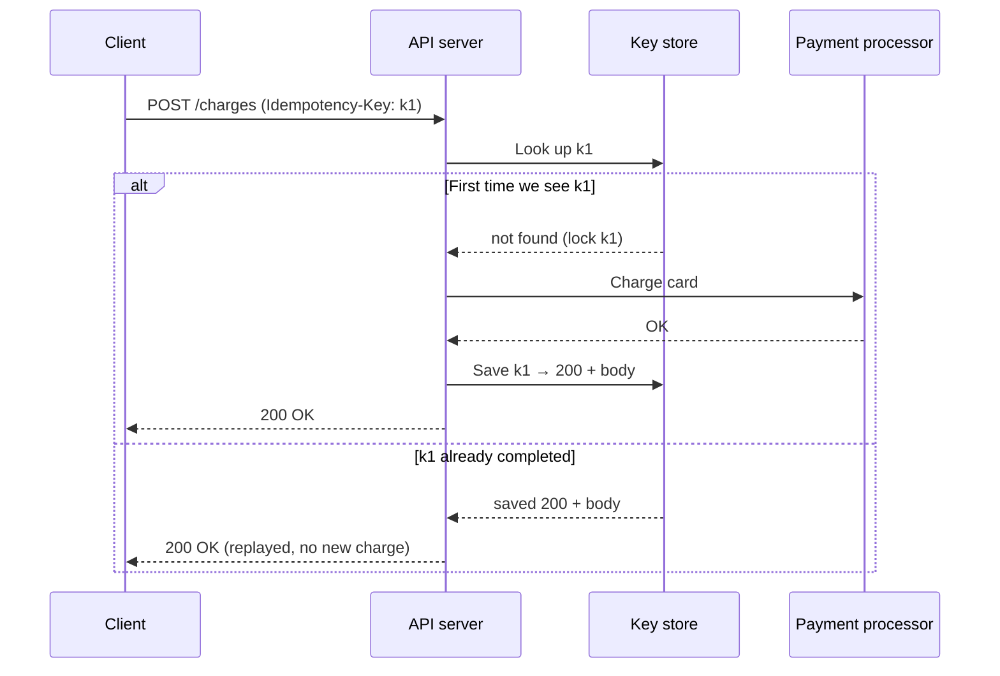

> This is a sample post. It shows the building blocks this blog supports: headings, a code block, a Mermaid diagram, an image with alt text, and tags. Replace it with your own notes whenever you like.

Networks fail in the most annoying way possible: **ambiguously**. A client sends `POST /charges`, the connection drops, and the client can't tell whether the server never got the request, got it and failed, or got it, charged the card, and lost the reply. Retrying blindly risks a double charge. Giving up risks a lost sale.

Payment APIs solve this with **idempotency keys**. The client creates a unique key for each *logical* operation and sends it with every attempt. The server makes sure the operation runs at most once per key and replays the stored result for any repeat.

## The core idea

An operation is *idempotent* if doing it twice has the same effect as doing it once. `GET` and `PUT` are idempotent by design. `POST /charges` is not, so we make it idempotent **per key**:

1. The client generates a key (a UUID v4 is fine) *before* the first attempt and reuses it on every retry.
2. The server stores `key → (request fingerprint, status, response)`.
3. If the key is new, the server executes the request and saves the response.
4. If the key has been seen with a finished response, the server returns the **saved response** without running the request again.
5. If the key is still in flight, the server rejects the concurrent duplicate (Stripe returns `409 Conflict`) so the client backs off and tries again.
6. If the same key arrives with a *different* request body, that's a client bug, so the server rejects it.


## How the request flows



## A minimal implementation

Here's the shape of it as Express-style middleware. A real system would put the key store in Postgres or Redis with a TTL, scope keys per account, and record progress for multi-step operations. Still, this captures the contract:

```ts
import { createHash } from 'node:crypto';

type Saved = { fingerprint: string; status: 'in_progress' | 'done'; code?: number; body?: unknown };
const store = new Map<string, Saved>(); // swap for a durable store with a TTL (e.g. 24h)

const fingerprint = (req: { method: string; path: string; body: unknown }) =>
  createHash('sha256').update(`${req.method} ${req.path} ${JSON.stringify(req.body)}`).digest('hex');

export function idempotent(handler: (req: any) => Promise<{ code: number; body: unknown }>) {
  return async (req: any, res: any) => {
    const key = req.header('Idempotency-Key');
    if (!key) return res.status(400).json({ error: 'Idempotency-Key header is required' });

    const fp = fingerprint(req);
    const existing = store.get(key);

    if (existing) {
      if (existing.fingerprint !== fp) return res.status(422).json({ error: 'Key reused with a different request' });
      if (existing.status === 'in_progress') return res.status(409).json({ error: 'Request already in progress' });
      return res.status(existing.code!).json(existing.body); // replay, no side effects
    }

    store.set(key, { fingerprint: fp, status: 'in_progress' });
    try {
      const { code, body } = await handler(req);
      store.set(key, { fingerprint: fp, status: 'done', code, body });
      return res.status(code).json(body);
    } catch (err) {
      store.delete(key); // let the client retry an operation that never happened
      throw err;
    }
  };
}
```

## What I took away

- **Retries are a feature, not an accident.** Once retries are safe, clients can be aggressive with them. Combine retries with exponential backoff and jitter so a fleet of clients doesn't stampede a recovering server.
- **The key belongs to the operation, not the attempt.** Generating a new key per retry quietly defeats the whole mechanism.
- **Atomicity is the hard part.** Saving the key and doing the side effect can't be fully atomic when the side effect is an external call. Production systems use recovery points or a state machine per key, so a crashed request can resume or be safely rolled back.

## Further reading

- Stripe API reference: [Idempotent requests](https://docs.stripe.com/api/idempotent_requests)
- Brandur Leach, [Implementing Stripe-like idempotency keys in Postgres](https://brandur.org/idempotency-keys)
