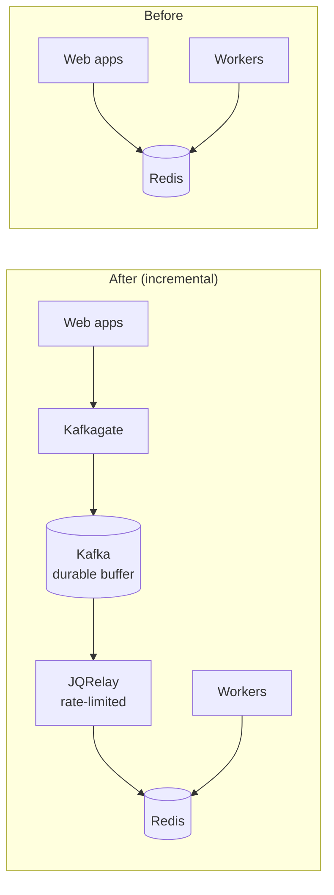
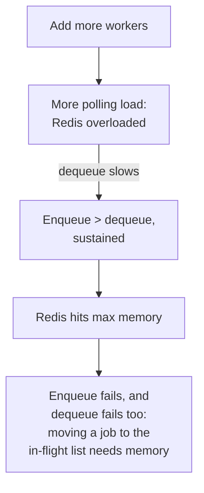
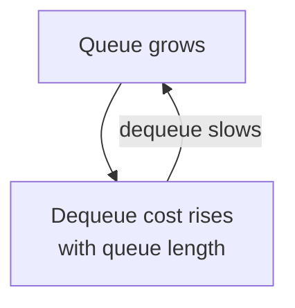

Slack’s job queue runs work that is too slow for a web request: every message post, push notification, URL unfurl, calendar reminder, and billing calculation. On the busiest days it processed over **1.4 billion jobs**, peaking at **33,000 per second**, with job times from a few milliseconds to several minutes [[Slack 2017]](https://slack.engineering/scaling-slacks-job-queue/).

An outage showed a hard limit of a Redis-only design. Resource contention in the database layer slowed job execution, Redis hit its max memory, and new jobs could not be enqueued. Dequeuing also needed free Redis memory to move a job onto a processing list — so even after the database recovered, the queue stayed locked and needed extensive manual intervention.

Slack’s fix was deliberately small: put **Kafka in front of Redis**, keep the existing enqueue and dequeue interfaces, and add two Go services — **Kafkagate** and **JQRelay** — rather than replacing Redis outright. The writeup is Saroj Yadav, Matthew Smillie, Mike Demmer, and Tyler Johnson’s [Scaling Slack’s Job Queue](https://slack.engineering/scaling-slacks-job-queue/) (December 6, 2017; updated June 25, 2020). I’ll cite it as **[Slack 2017]** below. Every Slack-specific number and architecture detail here comes from that post. Paragraphs marked **My take** are my own analysis.

*Figure 1: The minimum viable change described in [Slack 2017] — Kafka as a durable buffer in front of the existing Redis dequeue path. Layout is mine; component names are from the post.*

## What the old Redis queue looked like

[Slack 2017] sketches a classic Redis task queue:

1. On enqueue, the web app builds an ID from job type and arguments.
2. A hash of that ID plus the logical queue picks a Redis host.
3. Limited deduplication: if an identical ID is already queued, discard; otherwise enqueue.
4. Workers poll Redis, move a job from pending to in-flight, and spawn an async task.
5. Success removes the in-flight entry; failure goes to a retry queue, then a permanently failed list for manual repair.

That design had scaled through orders-of-magnitude growth. The post-mortem after the outage argued that further scaling on the same shape was untenable.

## Why Redis alone stopped being enough

[Slack 2017] lists several coupled problems:

- **Little memory headroom.** Sustained enqueue faster than dequeue exhausted Redis. With no free memory you could not enqueue — and you could not dequeue either, because moving a job into a processing list needed free memory.
- **A complete bipartite graph.** Every job-queue client had to connect to every Redis instance.
- **Workers could not scale independently of Redis.** More workers meant more polling load on Redis — a feedback loop when Redis was already overloaded.
- **Dequeue cost grew with queue length.** Earlier Redis data-structure choices made long queues harder to empty — another feedback loop.
- **Unclear QoS and semantics.** Engineers were reluctant to lean on the async queue; changing the limited deduplication was high-risk because many jobs depended on it.

They wanted three improvements over time: durable storage as a buffer, a better scheduler (rate limits, priority), and execution decoupled from Redis. For the first step they chose **incremental change**: add Kafka in front of Redis instead of replacing Redis, so application enqueue/dequeue interfaces could stay put.

**My take:** the memory coupling is the sharpest lesson. A full in-memory queue is not merely “behind” — if dequeue needs spare memory on the same box that holds the backlog, recovery needs humans. Separating *accept* from *execute* is the point of the durable buffer.

*Figure 2: How a backlog locked up the old queue, as described in [Slack 2017]. The diagram is my illustration.*

*Figure 3: The queue-length feedback loop described in [Slack 2017]. The diagram is my illustration.*

## Kafkagate: getting jobs into Kafka

Getting jobs out of a PHP/Hack web app into Kafka efficiently led Slack to build **Kafkagate**, a stateless Go service. It exposes a simple HTTP POST (topic, partition, content), uses Sarama with persistent broker connections, and returns success or failure synchronously [[Slack 2017]](https://slack.engineering/scaling-slacks-job-queue/).

Design choices:

1. **Bias to availability over consistency.** Writes wait for the leader acknowledgment only, not full replication — lowest latency, with a small risk of lost jobs if a broker dies before replicating. The team noted considering a stronger option for critical jobs.
2. **Simple client semantics.** Synchronous Kafka writes give a clear success/fail without dramatically changing how engineers think about enqueue.
3. **Same-AZ preferential routing.** Prefer Kafkagate in the same AWS availability zone as the enqueuer for latency and transfer cost, with failover to other AZs. A future idea: run Kafkagate on the web host itself to avoid an extra hop.

## JQRelay: Kafka back into Redis

**JQRelay** is a stateless Go service that reads a Kafka topic and writes to the corresponding Redis cluster. Highlights from [Slack 2017]:

- **JSON across languages.** The old path was PHP encode → Redis → PHP decode. JQRelay sits in the middle. Go’s JSON encoder escapes `<`, `>`, and `&` to Unicode entities by default; PHP escapes `/` by default. Those quirks caused representation mismatches that did not exist before.
- **Self-configuration.** On startup, acquire a Consul lock for a Kafka topic. Exactly one relay owns each topic. An EC2 auto-scaling group replaces failed hosts, which re-enter the lock flow.
- **Offsets after Redis success.** The partition consumer advances the commit offset only after a successful Redis write. Redis problems → retry indefinitely. Job-specific errors → re-enqueue to Kafka instead of blocking the partition or dropping the job.
- **Rate limits via Consul.** The watch API applies configured limits when writing to Redis.

## Kafka cluster and how they proved it

Per [Slack 2017]: Kafka **0.10.1.2**, **16 brokers** on **i3.2xlarge**, every topic **32 partitions**, replication factor **3**, retention **2 days**, rack-aware replication (rack = AZ), unclean leader election enabled. They load-tested at expected production rates and failure-tested: kill one broker; kill two in one AZ; hard-kill all three brokers to force an unclean leader; restart the cluster — and hit their availability goals.

## Production rollout

1. **Double writes** to Redis and Kafka, with JQRelay in shadow mode (read then drop).
2. **Compare job counts** along web → Kafkagate → Kafka → Redis.
3. **Heartbeat canaries** every minute for every Kafka partition across **50 Redis clusters** and **1600 partitions** (50 topics × 32).
4. **Internal Slack** for a few weeks, then roll out **job type by job type** for customers.

When enqueue again outpaces dequeue, jobs accumulate in Kafka. Operators adjust JQRelay rate limits or pause Redis enqueues — without the Redis OOM lockup. The post frames this as both an immediate reliability win and a foundation for later scheduling and execution work [[Slack 2017]](https://slack.engineering/scaling-slacks-job-queue/).

## Tradeoffs

| Decision | What Slack gained | What it cost |
| --- | --- | --- |
| Kafka in front of Redis (not a full replace) | Write availability under backlog; unchanged worker dequeue interface | Two systems to run; a relay path; scheduler work still ahead |
| Leader-ack only on produce | Lowest enqueue latency | Small loss window if a broker dies before replicating |
| One JQRelay per topic (Consul lock) | Clear ownership; ASG auto-heal | Per-topic relay throughput ceiling until you re-shard |
| Offset advance only after Redis write | No silent drop while Redis is down | At-least-once into Redis; duplicates under retry |
| Re-enqueue job-specific errors to Kafka | Bad job does not stall a partition | Poison jobs can recirculate until fixed |

**My take:** the gains are from the article. Parts of the “What it cost” column are my reading — the post is clearer on benefits than on ongoing operational costs.

## Patterns worth stealing

This section is my synthesis of [Slack 2017].

- **Separate accept from execute.** Enqueue availability should not require spare memory in the execution store.
- **Ship the minimum viable change on a critical path.** Buffering first, fancy scheduling later.
- **Collapse bipartite fan-out** with gateways and relays so every producer does not talk to every shard.
- **Backpressure needs knobs** (rate limits, pause) — not only a memory cliff.
- **Be honest about delivery:** durable retries imply at-least-once; keep dedup or idempotent consumers.
- **Don’t let poison messages freeze a partition.**
- **Prove the pipe** with shadow traffic, count reconciliation, and per-partition canaries before cutting customers over.

## A design question for you

**Design an async job system for notification fanout and webhook delivery** where enqueue must stay available even when workers are stuck (slow third-party APIs, database contention, or a thundering herd of retries). You currently have a Redis-backed queue like Slack’s old design; product engineers already rely on “at most one identical job queued” dedup and simple retries.

Work through:

1. Where durable buffering sits, and how backpressure works when enqueue ≫ dequeue.
2. Failure modes for lost jobs, duplicates, and poison payloads — and what the client sees on enqueue.
3. How you preserve or replace dedup across the new path.
4. An incremental migration from the in-memory queue that avoids a stop-the-world cutover.

Angles worth considering: what happens if dequeue needs free memory on the same Redis that holds the backlog; leader-ack vs stronger produce acks for push vs billing; where a dedup set must live once jobs can sit in a log Redis has not seen yet; what per-partition canaries catch that global counts miss; and how rate-limiting the relay interacts with log retention (Slack used two-day retention).

## Sources

Primary source:

- Saroj Yadav, Matthew Smillie, Mike Demmer, Tyler Johnson, [Scaling Slack’s Job Queue](https://slack.engineering/scaling-slacks-job-queue/), Engineering at Slack, December 6, 2017 (updated June 25, 2020).

Background and further reading:

- [Apache Kafka documentation](https://kafka.apache.org/documentation/#introduction) (logs, partitions, replication, offsets).
- [Redis lists](https://redis.io/docs/latest/develop/data-types/lists/) (common queue building block).
- [AWS Regions and Availability Zones](https://aws.amazon.com/about-aws/global-infrastructure/regions_az/) (context for same-AZ routing).
